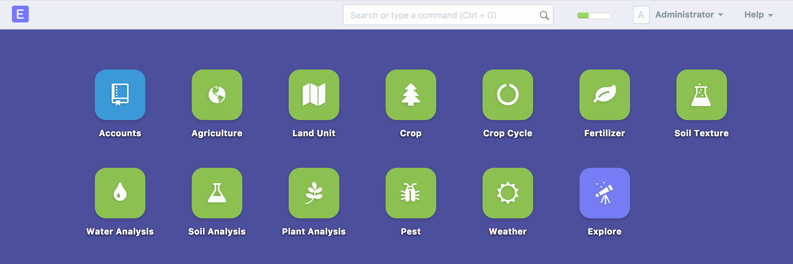

# Basic Setup
Documentation in progress, expected completion: Sunday, November 19, 2017)

Agri farm's cor and most important elements are:
1. **Land Unit:** Representing the physical space where the crops are planted
2. **Crop:** Characteristics of the crop, inputs and expected outputs, expected calendar of activities and harvest, etc.
3. **Crop Cycle:** Individual representation of a single planting in a specific area. (Links a crop to a Land Unit for a specified period)

Here we will learn to do a quick setup with the essential requirements to manage a simple example crop: Carrots
These instructions assume you have already completed the [basic ERPNext setup](https://erpnext.org/docs/user/manual/en/setting-up), and you have the ERPNext desk on your browser window.

 

## Land Unit
Before we do anything, we need to define some details about where our crops will be planted.
We will first create our farm as a parent land unit, and then we will add one or more fields as children or nodes, belonging to the parent.

1. On the desk, clik on the **Land Unit** icon.

 
 
 A list will show any existing Land Units.

2. On the top right, click on **New**  to create the first Land Unit.

A dialog will open

⋅⋅* In the Land Unit Name type: **Carrot farm**
⋅⋅* Leave **Parent Land Unit** empty.
⋅⋅* Check the box next to **Is Group**
⋅⋅* Click **Save** 

3. With the farm created, we can now create our first Carrot Field!
Click on **New** 

The New Land Unit Dialog pops up again

⋅⋅* In the Land Unit Name type: **Carrot Field 1**
⋅⋅* In **Parent Land Unit** type and select the one we just created in step two: **Carrot Farm**
⋅⋅* Leave the **Is Group** box unchecked
⋅⋅* Click **Save** 

4. Repeat step 3 for as many fields as you need.
 
## Crop
Now we need to specify what our crop will be. A crop summarizes all that is necessary before creatng our first crop cycle or planting.

1. On the desk, clik on the **Crop** icon.

 
 
 A list will show any existing Crops.

2. On the top right, click on **New**  to create the first Crop.

A new crop document will open, and we will enter basic information

⋅⋅1.The basic information should be entered as such:
⋅⋅⋅⋅* Common name for the crop: **Carrot**
⋅⋅⋅⋅* Scientific name: **Daucus carota**
⋅⋅⋅⋅* Type: **Biennial**
⋅⋅⋅⋅* Category: Leave empty
⋅⋅⋅⋅* Warehouse: Leave empty
⋅⋅⋅⋅* Planting UOM: **Unit**
⋅⋅⋅⋅* Yield UOM: **Grams**
⋅⋅⋅⋅* Click **Save** 

⋅⋅1. The basic information should be entered as such:We will skip the **Materials Required**, **Byproducts** and **Produce sections**.
⋅⋅1. In the **Ideal Agriculture Task List** we enter some planned tasks such as planting, watering, and harvesting.
(Please note, our activity list will be intentionally abbreviated for illustraion purposes: For this example we will prepare our field, plant the next day, water only once, add a cover after germination on day 12, remove weeds at day 19, and harvest at day 90

In the first row, type the following:
⋅⋅* Subject: **Preparation - Make rows**
⋅⋅* Start Day: **1**
⋅⋅* End Day: **1**
⋅⋅* Holiday Management: Previous Business Day

⋅⋅1. When done, you can click **Save**  to prevent
any work from being lost. We are not done yet, we simply have saved the minimum required information!

⋅⋅1. Continue filling the next rows with Task, Start Day, End Day and Holiday Management. 
⋅⋅* Row 2: Preparation - Add mulch cover, 1, 1, **Previous Business Day**
⋅⋅* Row 3: Planting - Sow the seeds, 2, 2, **Previous Business Day**
⋅⋅* Row 4: Water - 10ml per plant, 2, 2, **Ignore holidays**
⋅⋅* Row 5: Disease - Pest control - Cover with Fine Net, 12, 12, **Previous Business Day**
⋅⋅* Row 6: Weed Control - Remove weeds, 19, 19, **Previous Business Day**
⋅⋅* Row 7: Harvest - When top is at 5cm, 90, 90, **Previous Business Day**
⋅⋅* Click **Save** 

3. Repeat step 2 for as many crops as you need. You can save some time by duplicating existing crops and modifying only the necessary items
 
## Crop Cycle
 Once we have defined our crop, we can create as many crop cycles as we like, using the parameters outlined previously

1. On the desk, clik on the **Crop Cycle** icon.

 
 A list will show any existing Crop Cycles.

2. On the top right, click on **New**  to create the first Crop Cycle.

A new Crop Cycle document will open, and right away you see that two of the required items are a **Land Unit** and a **Crop**
We shall give it a descriptive name, to differentiate it from Crop Cycles we might create later.
⋅⋅* Title: **Carrot Planting Week 46**
⋅⋅* Land Unit: **Carrot Field 1** 
⋅⋅* Crop: **Carrot**
⋅⋅* Leave the **ISO 8016 Standard** (week count) box unchecked
⋅⋅* Crop Spacinglick **Save** 

3. With the farm created, we can now create our first Carrot Field!
Click on **New** 

The New Land Unit Dialog pops up again

⋅⋅* In the Land Unit Name type: **Carrot Field 1**
⋅⋅* In **Parent Land Unit** type and select the one we just created in step two: **Carrot Farm**
⋅⋅* Leave the **Is Group** box unchecked
⋅⋅* Click **Save** 

4. Repeat step 3 for as many fields as you need.

 * Do that
 * Do something else
 * Do different
 * Do more
 * Feel exhausted
 * Rest
 
Back to [Agri Farm ERPNext Documentation - (proposed)](Agri-Farm-ERPNext-Proposed-Doc) - [Previous Page](02-land-unit) - [Next Page](04-Crops)
