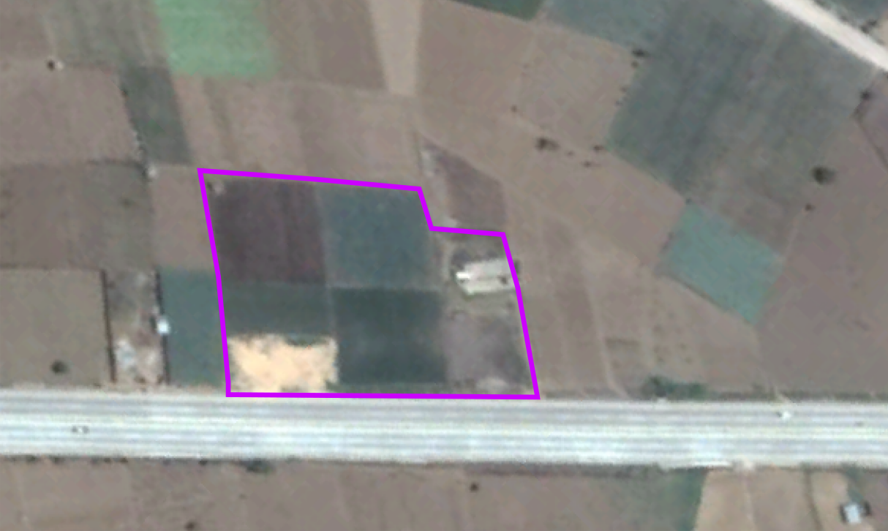

 # Land Unit (plot) (proposed)

 ## Marking your plot
 
 Our first step is to specify where we will grow our crops. 
 
 The Land Unit registers the physical space set apart for planting your crop. Each farm
 is usually subdivided into smaller plots, and Agri-Farm-ERPNext allows you to clearly
 specify how your farm is structured in the simplest manner possible.
 
 There are two types of land units. These can change or be modified over time.
 1. **Parent type**: This kind of land unit will have further units grouped within it. 
 You can specify usage Rights (rented vs owned) and a common Soil Texture Analysis.
 If all the plots belonging to this parent type have geospatial data, this Land Unit 
 will reflect the combined surface area of the plots belonging to it.   
 The user can have as many parent types belonging to other parent types. 
 All areas will be aggregated accordingly.
 2. **Children or Node type**: This kind of land unit is the smallest fraction of land unit 
 that Agri-Farm-ERPNext can manage. You can set a location pin or draw a delimiting 
 polygon on a map, and the information is stored in ERPNext to describe the specific
 area accurately. Agri-Farm-ERPNext will calculate the area automatically.
 You can also link Soil Texture Analysis and Soil Nutrient Analysis to this type of
 land unit.
 
 Let us consider an example of a farm that plants only carrots.
 Our farm is located beside a road, and its physical and legal boundaries are shown in magenta.
 
 
 
 

 
Back to [Agri Farm ERPNext Documentation - (proposed)](Agri-Farm-ERPNext-Proposed-Doc) - [Previous Page](01-introduction) - [Next Page](02-land-unit)
